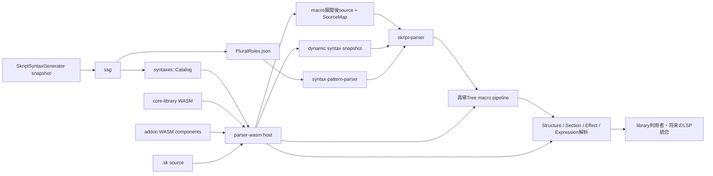

# Skript-LSP

[English](README.md)

Skript-LSPは、[Skript](https://github.com/SkriptLang/Skript)言語向けに開発中の
Language Serverです。このworkspaceは、SkriptSyntaxGenerator（SSG）がサーバーごとに
生成する構文データ、出典位置を保持するparser、LSP本体に組み込まずに解析へ参加できる
WebAssembly addon systemを中心に構成されています。

## 現在の状態

libraryにはsnapshot読み込み、登録pattern解析、source mapping、Text/Tree macro、Wasmtime host、
transactional StateStore、dynamic syntax登録、Expression・Condition・Effect・Event・Sectionの
再帰解析が実装されています。トップレベルStructure解析にはEntryValidatorと二段階lifecycleがあり、
document内のFunction宣言も登録して呼び出し解析に利用できます。

ただし、これはparser APIであり、完成したLanguage Serverではありません。ルートの`skript-lsp`
binaryは埋め込みCoreLibraryのbyte列を参照してsmoke-test用messageを表示するだけで、parser hostの
初期化やLSP/HTTP transportの公開は行いません。ルートlibraryは`new_parser_host`を提供し、
`effectcommandcli`は一行Effectを検証できる実行ファイルです。全文解析の統一JSON endpoint、
複数fileのsymbol service、variableの型flow解析は未実装です。個別構文のhandlerによっては
unresolvedなmetadataやpartial resultを返す場合があります。

## アーキテクチャ



想定しているデータの流れは次のとおりです。

1. Minecraft server上でSSGを実行し、その環境のSkriptとaddon構成に対応したschema 5
   snapshotを生成する。
2. `ssg`がsnapshotを検証し、保存形式に依存しない`syntaxes::Catalog`へ変換する。
   schema 3・4も引き続き読み込める。schema 5では`Language.json`が必須だが、旧schemaでは不要。
3. `parser-wasm`が必須のCoreLibraryと任意のaddon componentを読み込む。componentは
   初期化時とdocument prepass時に構文を追加または上書きできる。Text macroはdocument
   sourceをpreprocessし、Tree macroはlossless RawTreeを再帰的に変換する。
4. `syntax-pattern-parser`がSkriptの登録patternを表現し、`skript-parser`がText/Tree editを
   検証する。合成したSourceMapでmacro展開後sourceとの位置関係を追跡し、commentと
   indentationからlosslessなRawTreeを構築する。
5. callerはRawTreeを`ParserHost::parse_structures_in_parse`へ渡し、Structure headerと選択された
   bodyを、nested syntax・source付きdiagnosticまで解析できる。すべてのstageを統合した
   document serviceとLSP lifecycleの公開は今後の統合作業となる。

解析時に動作中のMinecraft・Paper・Java・Skriptは不要で、生成済みsnapshotとWASM componentを
使用します。ただし利用可能な構文はsnapshotのSkript/addon構成に従い、addon固有の意味処理には
追加のWASM addonが必要になる場合があります。

## Workspaceのcrate

| Crate | 種類 | 役割 |
| --- | --- | --- |
| [`skript-lsp`](./) | library / binary | 最上位の統合crate。CoreLibraryを埋め込み、parser hostを構築します。binaryは現時点ではscaffoldです。 |
| [`syntax-pattern-parser`](./syntax-pattern-parser/README.ja.md) | library | 選択肢、optional group、type expression、parse tag、parse markなど、Skriptへ登録された構文patternを解析します。`.sk` file自体は解析しません。 |
| [`ssg`](./ssg/README.ja.md) | library | SSG schema 3〜5 snapshot directoryを読み込み、完全性検証とruntime modelへの変換を行います。schema 5のlanguage dataも含みます。 |
| [`syntaxes`](./syntaxes/README.ja.md) | library | 正規化された構文domain model、index付きCatalog、type関係、alias、dynamic syntax registryを所有します。 |
| [`skript-parser`](./skript-parser/README.ja.md) | library | `.sk` document用のUTF-8 range、SourceMap、macro provenance、lossless RawTree、登録pattern照合、再帰syntax node、二段階Structure/EntryValidator解析を所有します。 |
| [`parser-wasm`](./parser-wasm/README.ja.md) | library | WIT ABIを定義し、Wasmtime host、hook registry、transactional syntax pipeline、Structure lifecycle、StateStore、dynamic syntax bridgeを実装します。 |
| [`core-library`](./core-library/README.ja.md) | WASM component | Skript標準の解析処理を実装する必須parser addonです。公開addon ABIだけを使い、primitive/type解析とSkript固有のExpression、Effect、Section、Structure意味処理を提供します。 |
| [`skripthub`](./skripthub/README.ja.md) | legacy library | 旧SkriptHub APIとflattenされたfunction文字列の互換readerです。新しい構文データには`ssg`と`syntaxes`を使用します。 |
| [`text-macro-addon`](./test-components/text-macro-addon/README.ja.md) | test WASM component | 順序付きText macro展開、UTF-8 edit、anchor、StateStore rollback、trapを検証します。 |
| [`tree-macro-addon`](./test-components/tree-macro-addon/README.ja.md) | test WASM component | 対象指定TreeEdit、再帰展開、provenance、cycle、StateStore rollback、quota、trapを検証します。 |
| [dynamic-syntax-addon](./test-components/dynamic-syntax-addon/README.ja.md) | test WASM component | dynamic registration、override、prepass、rollback、freeze、unloadを検証します。 |
| [`catalog-data-addon`](./test-components/catalog-data-addon/README.ja.md) | test WASM component | WIT経由の全source document・record取得、catalog query、response limitを検証します。 |
| [effect-addon](./test-components/effect-addon/README.ja.md) | test WASM component | Effect lifecycleの置換、Reject diagnostic、dynamic handler、採用state rollbackを検証します。 |
| [matching-addon](./test-components/matching-addon/README.ja.md) | test WASM component | 型付きmatching overrideと採用候補だけを残すStateStore rollbackを検証します。 |
| [`expression-data-addon`](./test-components/expression-data-addon/) | test WASM component | node-localなschema version付きExpression public data、Transform/Overrideによる置換・削除、raw JSON保持を2つのfeature variantで検証します。 |
| [`effect-command-cli`](./utilities/effect-command-cli/README.ja.md) | 解析utility | SSG snapshotからEffect pattern、Event文脈、capture、再帰Expression、解決typeを単発・REPLで確認する独立実行ファイル`effectcommandcli`を構築します。 |
| [`invalid-syntax-searcher`](./utilities/invalid-syntax-searcher/README.ja.md) | developer utility | SkriptHubデータを取得し、parserが拒否したpatternを分類します。 |
| [`xtask`](./xtask/README.ja.md) | build utility | core Wasm moduleのbuild、Component変換、export検証、local artifactの配置を行います。 |

各crate directoryの日本語READMEでは、公開範囲、責務の境界、依存関係、テスト方法を
より詳しく説明しています。

## Crateの選び方

入力が生成済みsnapshot directoryなら`ssg`を使用します。データ読み込み後に、構文、
class、converter、EventValue、aliasなどを検索する場合は`syntaxes`を使用します。

Skriptまたはaddonが登録した`(send|message) %string%`のような文字列には
`syntax-pattern-parser`を使用します。実際の`.sk` document内の位置と出典を扱う場合は
`skript-parser`を使用します。この2つは入力の意味が異なるため、同じparserとして
扱いません。

addon componentをhostする場合や共通WIT contractを使う場合は`parser-wasm`を使用します。
guest componentは`default-features = false`で依存し、guest側へWasmtimeをlinkしないように
します。

CoreLibraryの初期化にはSkript versionが必要です。読み込んだSSG Catalogを
`HostConfig::syntax_catalog`へ設定すると、hostがそのsource metadataからversionなど未設定の
runtime profileを補完します。Catalogのruntime metadataがない場合は、初期化用に
`HostConfig::runtime_profile`を明示してください。実際の構文解析にはCatalogが必要で、
defaultのHostConfigだけではparserの設定は完了しません。

## Buildとテスト

ルートcrateは、compile時に必須のCoreLibrary componentを埋め込みます。parserのintegration
testもtest componentを埋め込むため、workspace全体をcompileまたはtestする前に両方の
artifactをbuildします。

```sh
rustup target add wasm32-unknown-unknown
cargo run -p xtask --locked -- build-core-library
cargo run -p xtask --locked -- build-test-components
cargo test --workspace --all-features --locked
```

個別の確認には次のcommandを使用できます。

```sh
cargo test -p syntax-pattern-parser --locked
cargo test -p ssg --locked
cargo test -p syntaxes --locked
cargo test -p skript-parser --locked
cargo test -p parser-wasm --locked
cargo clippy --workspace --all-targets --all-features --locked -- -D warnings
```

artifactのbuild後、API referenceは次のcommandで生成できます。

```sh
cargo doc --workspace --all-features --no-deps --locked --open
```

`cargo doc`やdoc testも埋め込みcomponentを参照するため、同じartifactの準備が必要です。
Rust CIは`main`向けpull requestで実行され、両artifactをbuildしてから`--jobs 2`でworkspaceを
testします。`[profile.test]`はassertionとoverflow checkを保持したまま`opt-level = 1`を使用します。
通常のrelease設定とは別です。

`xtask`は`artifacts/core-library.wasm`と
`artifacts/catalog-data-addon.wasm`、`artifacts/dynamic-syntax-addon.wasm`、`artifacts/effect-addon.wasm`、
`artifacts/expression-data-addon-a.wasm`、`artifacts/expression-data-addon-b.wasm`、
`artifacts/matching-addon.wasm`、
`artifacts/text-macro-addon.wasm`、`artifacts/tree-macro-addon.wasm`を生成します。
生成artifactはcommitしません。
CoreLibraryが存在しない場合は意図的にcompile errorになります。CoreLibraryなしのparserは
support対象外だからです。

## Repositoryの境界

このrepositoryはSSGの出力を利用します。Minecraft serverの構文データを生成するplugin
そのものは含みません。generatorは独立したMinecraft pluginとして管理します。

SkriptHub supportは、互換性維持とparser corpusの調査にのみ残しています。新しいLSP機能が
SkriptHub serviceの可用性やdata shapeへ依存してはいけません。
