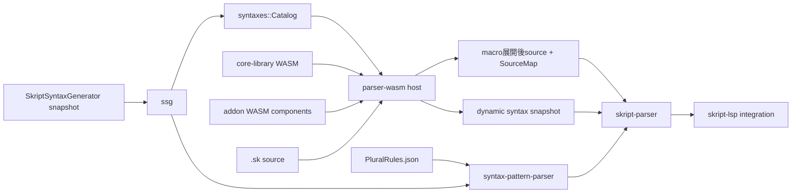

# Skript-LSP

[English](README.md)

Skript-LSPは、[Skript](https://github.com/SkriptLang/Skript)言語向けに開発中の
Language Serverです。このworkspaceは、SkriptSyntaxGenerator（SSG）がサーバーごとに
生成する構文データ、出典位置を保持するparser、LSP本体に組み込まずに解析へ参加できる
WebAssembly addon systemを中心に構成されています。

## 現在の状態

構文データモデル、構文pattern parser、source mappingの基礎、WASM ABI、Wasmtime host、
transactional StateStore、dynamic syntax registry、Text macro preprocessing pipeline、
losslessなcomment/indentation RawTreeは実装済みで、テストされています。

実行ファイルはまだscaffoldです。必須のCoreLibraryを埋め込んで初期化しますが、LSPの
transportは公開しておらず、完全な`.sk` documentのparseもまだ行いません。各crateの
READMEでは、現在の実装と将来の統合箇所を区別して説明しています。

## アーキテクチャ



想定しているデータの流れは次のとおりです。

1. Minecraft server上でSSGを実行し、その環境のSkriptとaddon構成に対応したschema 3
   snapshotを生成する。
2. `ssg`がsnapshotを検証し、保存形式に依存しない`syntaxes::Catalog`へ変換する。
3. `parser-wasm`が必須のCoreLibraryと任意のaddon componentを読み込む。componentは
   初期化時とdocument prepass時に構文を追加または上書きでき、Text macro componentは
   document sourceをpreprocessできる。
4. `syntax-pattern-parser`がSkriptの登録patternを表現し、`skript-parser`がText editを検証し、
   合成したSourceMapでmacro展開後sourceとの位置関係を追跡して、commentとindentationから
   losslessなRawTreeを構築する。
5. ルートの`skript-lsp` crateが、最終的にこれらをdocument解析とLSP機能へ統合する。

## Workspaceのcrate

| Crate | 種類 | 役割 |
| --- | --- | --- |
| [`skript-lsp`](./) | library / binary | 最上位の統合crate。CoreLibraryを埋め込み、parser hostを構築します。binaryは現時点ではscaffoldです。 |
| [`syntax-pattern-parser`](./syntax-pattern-parser/README.ja.md) | library | 選択肢、optional group、type expression、parse tag、parse markなど、Skriptへ登録された構文patternを解析します。`.sk` file自体は解析しません。 |
| [`ssg`](./ssg/README.ja.md) | library | SSG schema 3 snapshot directoryを読み込み、完全性を検証してruntime modelへ変換します。 |
| [`syntaxes`](./syntaxes/README.ja.md) | library | 正規化された構文domain model、index付きCatalog、type関係、alias、dynamic syntax registryを所有します。 |
| [`skript-parser`](./skript-parser/README.ja.md) | library | `.sk` document用のUTF-8 range、SourceMap、macro provenance、syntax context、lossless RawTreeを所有します。 |
| [`parser-wasm`](./parser-wasm/README.ja.md) | library | WIT ABIを定義し、Wasmtime host、hook registry、StateStore、dynamic syntax bridgeを実装します。 |
| [`core-library`](./core-library/README.ja.md) | WASM component | Skript標準の解析処理を実装するための必須parser addonです。現在はABI negotiationとhealth hookを提供します。 |
| [`skripthub`](./skripthub/README.ja.md) | legacy library | 旧SkriptHub APIとflattenされたfunction文字列の互換readerです。新しい構文データには`ssg`と`syntaxes`を使用します。 |
| [`text-macro-addon`](./test-components/text-macro-addon/README.ja.md) | test WASM component | 順序付きText macro展開、UTF-8 edit、anchor、StateStore rollback、trapを検証します。 |
| [`dynamic-syntax-addon`](./test-components/dynamic-syntax-addon/README.ja.md) | test WASM component | dynamic registration、override、prepass、rollback、freeze、unloadを検証します。 |
| [`invalid-syntax-searcher`](./utilities/invalid-syntax-searcher/README.ja.md) | developer utility | SkriptHubデータを取得し、parserが拒否したpatternを分類します。 |
| [`xtask`](./xtask/README.ja.md) | build utility | core Wasm moduleのbuild、Component変換、export検証、local artifactの配置を行います。 |

各crate directoryの日本語READMEでは、公開範囲、責務の境界、依存関係、テスト方法を
より詳しく説明しています。

## Crateの選び方

入力が生成済みsnapshot directoryなら`ssg`を使用します。データ読み込み後に、構文、
class、converter、EventValue、aliasなどを検索する場合は`syntaxes`を使用します。

Skriptまたはaddonが登録した`(send|message) %string%`のような文字列には
`syntax-pattern-parser`を使用します。実際の`.sk` document内の位置と出典を扱う場合は
`skript-parser`を使用します。この2つは入力の意味が異なるため、同じparserとして
扱いません。

addon componentをhostする場合や共通WIT contractを使う場合は`parser-wasm`を使用します。
guest componentは`default-features = false`で依存し、guest側へWasmtimeをlinkしないように
します。

## Buildとテスト

ルートcrateは、compile時に必須のCoreLibrary componentを埋め込みます。parserのintegration
testもtest componentを埋め込むため、workspace全体をcompileまたはtestする前に両方の
artifactをbuildします。

```sh
rustup target add wasm32-unknown-unknown
cargo run -p xtask --locked -- build-core-library
cargo run -p xtask --locked -- build-test-components
cargo test --workspace --all-features --locked
```

個別の確認には次のcommandを使用できます。

```sh
cargo test -p syntax-pattern-parser --locked
cargo test -p ssg --locked
cargo test -p syntaxes --locked
cargo test -p skript-parser --locked
cargo test -p parser-wasm --locked
cargo clippy --workspace --all-targets --all-features --locked -- -D warnings
```

`xtask`は`artifacts/core-library.wasm`と
`artifacts/dynamic-syntax-addon.wasm`、`artifacts/text-macro-addon.wasm`を生成します。
生成artifactはcommitしません。
CoreLibraryが存在しない場合は意図的にcompile errorになります。CoreLibraryなしのparserは
support対象外だからです。

## Repositoryの境界

このrepositoryはSSGの出力を利用します。Minecraft serverの構文データを生成するplugin
そのものは含みません。generatorは独立したMinecraft pluginとして管理します。

SkriptHub supportは、互換性維持とparser corpusの調査にのみ残しています。新しいLSP機能が
SkriptHub serviceの可用性やdata shapeへ依存してはいけません。
