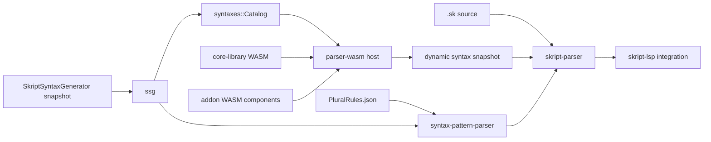

# Skript-LSP

[日本語](README.ja.md)

Skript-LSP is a work-in-progress language server for the
[Skript](https://github.com/SkriptLang/Skript) language. The workspace is
being built around server-specific syntax data generated by
SkriptSyntaxGenerator (SSG), a parser that preserves source provenance, and a
WebAssembly addon system that can participate in parsing without becoming part
of the LSP binary.

## Current Status

The syntax data, syntax-pattern parser, source mapping primitives, WASM ABI,
Wasmtime host, transactional StateStore, and dynamic syntax registry are
implemented and tested.

The executable is still a scaffold. It embeds and initializes CoreLibrary, but
it does not yet expose an LSP transport or parse complete `.sk` documents.
Crate READMEs distinguish current behavior from planned integration points.

## Architecture



The intended data flow is:

1. A Minecraft server runs SSG and produces a schema 3 snapshot for its exact
   Skript and addon set.
2. `ssg` validates the snapshot and converts it into the format-independent
   `syntaxes::Catalog`.
3. `parser-wasm` loads mandatory CoreLibrary and optional addon components.
   Components may add or override syntax during initialization and document
   prepass.
4. `syntax-pattern-parser` represents Skript registration patterns, while
   `skript-parser` tracks original and macro-expanded source ranges.
5. The root `skript-lsp` crate will compose these pieces into document parsing
   and LSP features.

## Workspace Crates

| Crate | Kind | Responsibility |
| --- | --- | --- |
| [`skript-lsp`](./) | library and binary | Top-level integration crate. Embeds CoreLibrary and constructs the parser host. The binary is currently a scaffold. |
| [`syntax-pattern-parser`](./syntax-pattern-parser/) | library | Parses Skript syntax registration patterns such as choices, optional groups, type expressions, parse tags, and parse marks. It does not parse `.sk` files. |
| [`ssg`](./ssg/) | library | Loads, verifies, validates, and converts SSG schema 3 snapshot directories. |
| [`syntaxes`](./syntaxes/) | library | Owns the normalized syntax domain model, indexed catalog, type relationships, aliases, and dynamic syntax registry. |
| [`skript-parser`](./skript-parser/) | library | Owns UTF-8 ranges, SourceMap data, macro expansion provenance, and syntax contexts for the future `.sk` parser. |
| [`parser-wasm`](./parser-wasm/) | library | Defines the WIT ABI and implements the Wasmtime host, hook registry, StateStore, and dynamic syntax bridge. |
| [`core-library`](./core-library/) | WASM component | Mandatory parser addon component reserved for Skript's built-in parsing behavior. It currently supplies ABI negotiation and a health hook. |
| [`skripthub`](./skripthub/) | legacy library | Compatibility reader for the old SkriptHub API and its flattened function strings. New syntax data should use `ssg` and `syntaxes`. |
| [`dynamic-syntax-addon`](./test-components/dynamic-syntax-addon/) | test WASM component | Exercises dynamic registration, override, prepass, rollback, freeze, and unload behavior. |
| [`invalid-syntax-searcher`](./utilities/invalid-syntax-searcher/) | developer utility | Fetches SkriptHub data and groups patterns rejected by the parsers. |
| [`xtask`](./xtask/) | build utility | Builds core Wasm modules, converts them to Components, validates exports, and publishes local artifacts. |

Each crate directory contains a more detailed README covering its public
surface, boundaries, dependencies, and tests.

## Choosing a Crate

Use `ssg` when the input is a generated snapshot directory. Use `syntaxes` once
the data is loaded and consumers need indexed syntax, class, converter,
event-value, or alias queries.

Use `syntax-pattern-parser` for strings registered by Skript or an addon, for
example `(send|message) %string%`. Use `skript-parser` for positions and
provenance in an actual `.sk` document. These inputs are different and should
not be routed through the same parser.

Use `parser-wasm` to host addon components or use the shared WIT contract.
Guest components should depend on it with `default-features = false` so
Wasmtime is not linked into the guest.

## Build and Test

The root crate embeds the mandatory CoreLibrary component at compile time.
Parser integration tests also embed test components. Build both artifact sets
before compiling or testing the complete workspace:

```sh
rustup target add wasm32-unknown-unknown
cargo run -p xtask --locked -- build-core-library
cargo run -p xtask --locked -- build-test-components
cargo test --workspace --all-features --locked
```

Useful focused checks are:

```sh
cargo test -p syntax-pattern-parser --locked
cargo test -p ssg --locked
cargo test -p syntaxes --locked
cargo test -p skript-parser --locked
cargo test -p parser-wasm --locked
cargo clippy --workspace --all-targets --all-features --locked -- -D warnings
```

`xtask` writes `artifacts/core-library.wasm` and
`artifacts/dynamic-syntax-addon.wasm`. Generated artifacts are not committed.
A missing CoreLibrary artifact is intentionally a compile-time error because
the parser is not supported without CoreLibrary.

## Repository Boundaries

This repository consumes SSG output; it does not generate server syntax data.
The generator remains an independent Minecraft plugin.

SkriptHub support remains only for compatibility and parser corpus analysis.
New LSP behavior must not introduce a dependency on the availability or data
shape of the SkriptHub service.
