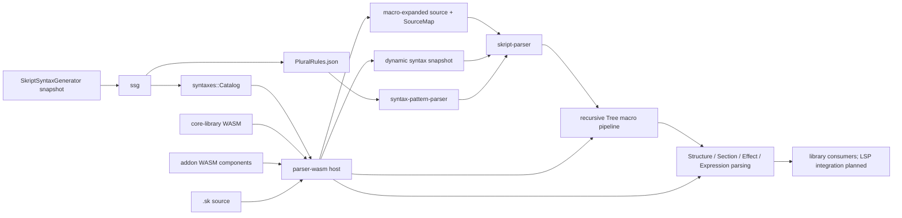

# Skript-LSP

[日本語](README.ja.md)

Skript-LSP is a work-in-progress language server for the
[Skript](https://github.com/SkriptLang/Skript) language. The workspace is
being built around server-specific syntax data generated by
SkriptSyntaxGenerator (SSG), a parser that preserves source provenance, and a
WebAssembly addon system that can participate in parsing without becoming part
of the LSP binary.

## Current Status

The libraries implement snapshot loading, registration-pattern parsing, source
mapping, Text/Tree macros, a Wasmtime host, transactional StateStore, dynamic
syntax registration, and recursive Expression, Condition, Effect, Event, and
Section parsing. Top-level Structure parsing includes EntryValidator handling
and a two-pass lifecycle with document-local Function registration.

These are parser APIs, not a finished language server. The root `skript-lsp`
binary only references the bundled CoreLibrary bytes and prints a smoke-test
message; it does not initialize a parser host or expose an LSP/HTTP transport.
The root library provides `new_parser_host`, and `effectcommandcli` is a working
one-line Effect inspector. There is no unified whole-document JSON endpoint,
cross-file symbol service, or variable type-flow analysis yet. Individual
syntax handlers may still return unresolved metadata or partial results.

## Architecture



The intended data flow is:

1. A Minecraft server runs SSG and produces a schema 5 snapshot for its exact
   Skript and addon set.
2. `ssg` validates the snapshot and converts it into the format-independent
   `syntaxes::Catalog`. Schema 3 and 4 snapshots remain readable. Schema 5 adds
   the required `Language.json`; older schemas do not require that file.
3. `parser-wasm` loads mandatory CoreLibrary and optional addon components.
   Components may add or override syntax during initialization and document
   prepass. Text macros preprocess document source, and Tree macros transform
   the lossless RawTree recursively.
4. `syntax-pattern-parser` represents Skript registration patterns, while
   `skript-parser` validates Text and Tree edits, tracks original and
   macro-expanded ranges through composed SourceMaps, and builds a lossless
   RawTree from comments and indentation.
5. Callers can pass the resulting RawTree to
   `ParserHost::parse_structures_in_parse` to parse Structure headers and their
   selected bodies, including nested syntax and source-mapped diagnostics.
   Composing every stage into a single public document service and LSP
   lifecycle remains integration work.

Parsing uses a prepared snapshot and WASM components, not a running Minecraft,
Paper, Java, or Skript instance. The snapshot still determines the available
Skript/addon syntax; addon-specific semantics may also require a WASM addon.

## Workspace Crates

| Crate | Kind | Responsibility |
| --- | --- | --- |
| [`skript-lsp`](./) | library and binary | Top-level integration crate. Embeds CoreLibrary and constructs the parser host. The binary is currently a scaffold. |
| [`syntax-pattern-parser`](./syntax-pattern-parser/) | library | Parses Skript syntax registration patterns such as choices, optional groups, type expressions, parse tags, and parse marks. It does not parse `.sk` files. |
| [`ssg`](./ssg/) | library | Loads, verifies, validates, and converts SSG schema 3 through 5 snapshot directories, including schema 5 language data. |
| [`syntaxes`](./syntaxes/) | library | Owns the normalized syntax domain model, indexed catalog, type relationships, aliases, and dynamic syntax registry. |
| [`skript-parser`](./skript-parser/) | library | Owns UTF-8 ranges, SourceMaps, macro provenance, lossless RawTree, registered-pattern matching, recursive syntax nodes, and two-pass Structure/EntryValidator parsing for `.sk` documents. |
| [`parser-wasm`](./parser-wasm/) | library | Defines the WIT ABI and implements the Wasmtime host, hook registry, transactional syntax pipelines, Structure lifecycle, StateStore, and dynamic syntax bridge. |
| [`core-library`](./core-library/) | WASM component | Mandatory parser addon component for Skript built-ins. It supplies primitive/type parsing and Skript-specific Expression, Effect, Section, and Structure semantics through the public addon ABI. |
| [`skripthub`](./skripthub/) | legacy library | Compatibility reader for the old SkriptHub API and its flattened function strings. New syntax data should use `ssg` and `syntaxes`. |
| [`text-macro-addon`](./test-components/text-macro-addon/) | test WASM component | Exercises ordered Text macro expansion, UTF-8 edits, anchors, StateStore rollback, and traps. |
| [`tree-macro-addon`](./test-components/tree-macro-addon/) | test WASM component | Exercises targeted TreeEdit operations, recursive expansion, provenance, cycles, StateStore rollback, quotas, and traps. |
| [dynamic-syntax-addon](./test-components/dynamic-syntax-addon/) | test WASM component | Exercises dynamic registration, override, prepass, rollback, freeze, and unload behavior. |
| [`catalog-data-addon`](./test-components/catalog-data-addon/) | test WASM component | Exercises complete source-document and record access, catalog queries, and response limits through WIT. |
| [effect-addon](./test-components/effect-addon/) | test WASM component | Exercises Effect lifecycle replacement, rejection diagnostics, dynamic handlers, and selected-state rollback. |
| [matching-addon](./test-components/matching-addon/) | test WASM component | Exercises typed matching overrides and selected-candidate StateStore rollback. |
| [`expression-data-addon`](./test-components/expression-data-addon/) | test WASM component | Exercises node-local schema-versioned Expression public data, Transform/Override replacement and removal, and lossless raw JSON across two feature variants. |
| [`effect-command-cli`](./utilities/effect-command-cli/) | analysis utility | Builds `effectcommandcli`, a standalone one-shot and REPL inspector for Effect patterns, Event contexts, captures, recursive Expressions, and resolved types from an SSG snapshot. |
| [`invalid-syntax-searcher`](./utilities/invalid-syntax-searcher/) | developer utility | Fetches SkriptHub data and groups patterns rejected by the parsers. |
| [`xtask`](./xtask/) | build utility | Builds core Wasm modules, converts them to Components, validates exports, and publishes local artifacts. |

Each crate directory contains a more detailed README covering its public
surface, boundaries, dependencies, and tests.

## Choosing a Crate

Use `ssg` when the input is a generated snapshot directory. Use `syntaxes` once
the data is loaded and consumers need indexed syntax, class, converter,
event-value, or alias queries.

Use `syntax-pattern-parser` for strings registered by Skript or an addon, for
example `(send|message) %string%`. Use `skript-parser` for positions and
provenance in an actual `.sk` document. These inputs are different and should
not be routed through the same parser.

Use `parser-wasm` to host addon components or use the shared WIT contract.
Guest components should depend on it with `default-features = false` so
Wasmtime is not linked into the guest.

CoreLibrary initialization requires a known Skript version. Set
`HostConfig::syntax_catalog` to the loaded SSG Catalog: the host inherits missing
runtime-profile fields, including that version, from its source metadata.
Without Catalog runtime metadata, supply `HostConfig::runtime_profile`
explicitly for initialization. Actual syntax parsing still requires a Catalog;
a default host configuration alone is not a complete parser setup.

## Build and Test

The root crate embeds the mandatory CoreLibrary component at compile time.
Parser integration tests also embed test components. Build both artifact sets
before compiling or testing the complete workspace:

```sh
rustup target add wasm32-unknown-unknown
cargo run -p xtask --locked -- build-core-library
cargo run -p xtask --locked -- build-test-components
cargo test --workspace --all-features --locked
```

Useful focused checks are:

```sh
cargo test -p syntax-pattern-parser --locked
cargo test -p ssg --locked
cargo test -p syntaxes --locked
cargo test -p skript-parser --locked
cargo test -p parser-wasm --locked
cargo clippy --workspace --all-targets --all-features --locked -- -D warnings
```

After building the artifacts, generate the API reference with:

```sh
cargo doc --workspace --all-features --no-deps --locked --open
```

The same artifact prerequisites apply to `cargo doc` and doc tests because
crate documentation and examples compile against the embedded components.
Rust CI runs on pull requests targeting `main`, builds both artifact sets, and
runs workspace tests with `--jobs 2`. `[profile.test]` uses `opt-level = 1` while
keeping test assertions and overflow checks; normal release settings are separate.

`xtask` writes `artifacts/core-library.wasm` and
`artifacts/catalog-data-addon.wasm`, `artifacts/dynamic-syntax-addon.wasm`, `artifacts/effect-addon.wasm`,
`artifacts/expression-data-addon-a.wasm`, `artifacts/expression-data-addon-b.wasm`,
`artifacts/matching-addon.wasm`,
`artifacts/text-macro-addon.wasm`, and `artifacts/tree-macro-addon.wasm`.
Generated artifacts are not committed.
A missing CoreLibrary artifact is intentionally a compile-time error because
the parser is not supported without CoreLibrary.

## Repository Boundaries

This repository consumes SSG output; it does not generate server syntax data.
The generator remains an independent Minecraft plugin.

SkriptHub support remains only for compatibility and parser corpus analysis.
New LSP behavior must not introduce a dependency on the availability or data
shape of the SkriptHub service.
